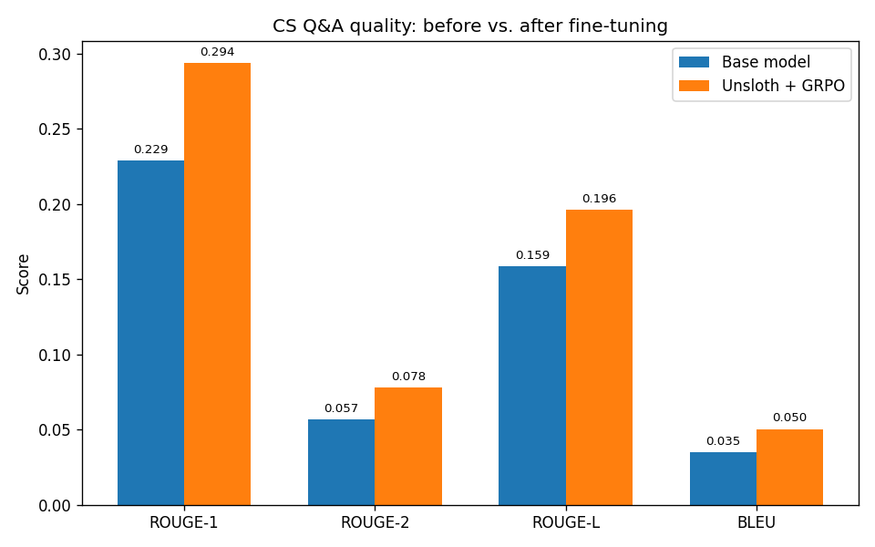
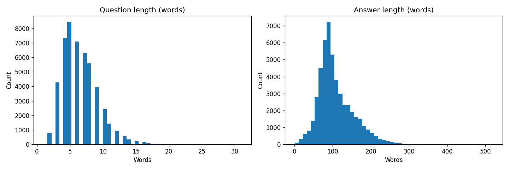
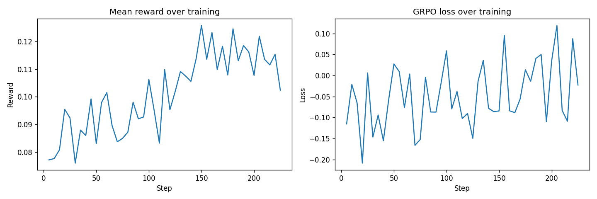

<a id="readme-top"></a>

<div align="center">

# 🧠 Phi CS-QA Fine-Tuning

[](https://github.com/kasrakr/Microsoft-Phi-Fine-Tuning-with-LoRA-GRPO-for-CS-Questions)

Fine-tuning **Microsoft Phi-1.5B** for computer-science question answering using **4-bit QLoRA/LoRA**, **GRPO**, and **Unsloth** on a lightweight GPU setup.

<p>
  
  
  
  
</p>
<p>
  
  
  
  
  
  
</p>

<p>
  <a href="https://colab.research.google.com/github/kasrakr/Microsoft-Phi-Fine-Tuning-with-LoRA-GRPO-for-CS-Questions/blob/main/Fine_Tuning_Phi_Microsft_QLoRA%2BGRPO.ipynb">
    
  </a>
</p>

<p>
  
</p>

</div>

---

<div align="center">
  
</div>

---

## 📖 Table of Contents

- [About the Project](#-about-the-project)
- [How It Works](#-how-it-works)
- [Features](#-features)
- [Dataset](#-dataset)
- [Results](#-results)
- [Visualizations](#-visualizations)
- [Tech Stack](#-tech-stack)
- [Architecture](#-architecture)
- [License](#-license)
- [Contact](#-contact)

---

## 🧭 About the Project

This project explores parameter-efficient fine-tuning of **Microsoft Phi-1.5B** for **computer-science question answering**.

The notebook combines three ideas:

> **4-bit loading + LoRA adapters + GRPO optimization**

The goal is to adapt a relatively small language model to CS-style question answering while keeping GPU memory requirements manageable. The training pipeline uses **Unsloth** for optimized model loading and fine-tuning, **LoRA** for parameter-efficient adaptation, and **GRPO** with a custom reward function based on answer similarity and output-length control.

The repository currently contains the main training notebook together with the generated dataset, training, and before/after metric visualizations. The notebook records an **NVIDIA Tesla T4** run with **FP16** training and explicitly disables BF16 for that setup.

<p align="right">(<a href="#readme-top">back to top</a>)</p>

---

## ⚙️ How It Works

```text
┌──────────────────────────────┐
│  CS Question + Reference     │
│  Question / Answer Dataset   │
└──────────────┬───────────────┘
               │
               ▼
┌──────────────────────────────┐
│      Data Preparation        │
│  shuffle → train/eval split  │
│  prompt → reference format   │
└──────────────┬───────────────┘
               │
               ▼
┌──────────────────────────────┐
│       Microsoft Phi-1.5B     │
│        4-bit loading         │
└──────────────┬───────────────┘
               │
               ▼
┌──────────────────────────────┐
│       LoRA / QLoRA            │
│  rank 16 adapters             │
│  q/k/v + dense + fc1/fc2     │
└──────────────┬───────────────┘
               │
               ▼
┌──────────────────────────────┐
│          GRPO Training        │
│  custom reward function       │
│  ROUGE-L + BLEU + guard       │
└──────────────┬───────────────┘
               │
               ▼
┌──────────────────────────────┐
│      Post-training Eval       │
│  ROUGE-1 / ROUGE-2 / ROUGE-L │
│  BLEU + qualitative samples   │
└──────────────────────────────┘
```

The workflow first loads the question-answer dataset, creates instruction-style prompts, loads Phi-1.5B in 4-bit mode with Unsloth, attaches LoRA adapters, and then trains with GRPO. Before and after fine-tuning, generated answers are evaluated against references using ROUGE and BLEU.

<p align="right">(<a href="#readme-top">back to top</a>)</p>

---

## ✨ Features

|     | Feature | Description |
|:---:|---|---|
| 🧠 | **Phi-1.5B Fine-Tuning** | Adapts Microsoft's Phi-1.5B language model to CS question-answering. |
| ⚡ | **Unsloth** | Uses Unsloth's optimized loading and training path for faster, memory-aware fine-tuning. |
| 🧩 | **QLoRA / LoRA** | Loads the model in 4-bit and trains lightweight LoRA adapters instead of full model weights. |
| 🎯 | **GRPO** | Uses Group Relative Policy Optimization with a custom reward function for generated answers. |
| 📊 | **Automatic Evaluation** | Compares baseline and fine-tuned generations using ROUGE-1, ROUGE-2, ROUGE-L, and BLEU. |
| 🧪 | **Qualitative Evaluation** | Prints side-by-side base, reference, and fine-tuned answers for selected CS questions. |
| 📈 | **Training Curves** | Saves reward and loss curves generated from the GRPO training log. |
| 💾 | **Checkpointing** | Saves training checkpoints during the GRPO run with a limited checkpoint retention policy. |
| 🖥️ | **T4-Friendly Setup** | Configured around a single Tesla T4 with FP16 and 4-bit model loading. |

<p align="right">(<a href="#readme-top">back to top</a>)</p>

---

## 📚 Dataset

The project uses:

**[`AlgorithmicResearchGroup/arxiv-cs-ml-instruct-tune-50k`](https://huggingface.co/datasets/AlgorithmicResearchGroup/arxiv-cs-ml-instruct-tune-50k)**

The loaded training split contains **50,063 question-answer pairs** with the following fields:

| Field | Description |
|---|---|
| `question` | Computer-science style question / instruction |
| `answer` | Reference answer used for evaluation and reward calculation |

The dataset analysis in the notebook reports:

| Statistic | Value |
|---|---:|
| Total rows loaded | **50,063** |
| Median question length | **6 words** |
| Median answer length | **96 words** |
| 95th percentile answer length | **196 words** |
| Training examples used | **2,000** |
| Metric evaluation examples | **150** |
| Qualitative examples | **5** |

For the experiment, the full dataset is shuffled with a fixed seed, then the first **2,000 examples** are used for GRPO training and the following **150 examples** are reserved for metric evaluation.

<p align="right">(<a href="#readme-top">back to top</a>)</p>

---

## 🎯 Reward Function

The GRPO reward combines semantic overlap and a simple output-format guard:

```text
Reward = 0.6 × ROUGE-L + 0.4 × BLEU + length_guard
```

The length guard penalizes empty completions and outputs longer than 300 words. This gives the trainer a compact objective that rewards similarity to the reference answer while discouraging excessively long generations.

<p align="right">(<a href="#readme-top">back to top</a>)</p>

---

## 📈 Results

The notebook evaluates the original model and the fine-tuned model on the same evaluation subset.

| Metric | Baseline | After Unsloth + QLoRA + GRPO |
|---|---:|---:|
| **ROUGE-1** | 0.2287 | **0.2937** |
| **ROUGE-2** | 0.0568 | **0.0778** |
| **ROUGE-L** | 0.1586 | **0.1960** |
| **BLEU** | 0.0348 | **0.0502** |

These values are the reported measurements from the notebook's evaluation run; they describe this specific evaluation split and configuration rather than a general benchmark result.

### Qualitative Samples

The notebook also compares generated answers from the base and fine-tuned models for selected questions, alongside the reference answer.

```text
Question
   │
   ├── Reference answer
   ├── Base model answer
   └── Fine-tuned answer
```

<p align="right">(<a href="#readme-top">back to top</a>)</p>

---

## 🖼️ Visualizations

### 1. Before vs. After Metrics


### 2. Dataset Length Distribution



### 3. GRPO Training Curves



<p align="right">(<a href="#readme-top">back to top</a>)</p>

---

## 🧱 Tech Stack

<div align="center">


</div>

### Main Components

| Layer | Technology |
|---|---|
| Base model | Microsoft Phi-1.5B |
| Fine-tuning | LoRA / QLoRA |
| RL-style optimization | GRPO |
| Training acceleration | Unsloth |
| Model framework | PyTorch + Transformers |
| Trainer | TRL `GRPOTrainer` |
| Evaluation | ROUGE + BLEU |
| Dataset | Hugging Face Datasets |
| GPU | NVIDIA Tesla T4 |
| Precision | FP16 |

<p align="right">(<a href="#readme-top">back to top</a>)</p>

---

## 🏗️ Architecture

### Training Flow

```text
Hugging Face Dataset
        │
        ▼
  Shuffle + Split
        │
        ▼
  Prompt Formatting
        │
        ▼
   Phi-1.5B (4-bit)
        │
        ▼
   LoRA Adapters
        │
        ▼
    GRPO Trainer
        │
        ├───────────────┐
        ▼               ▼
  Reward Function   Checkpoints
        │
        ▼
  Fine-tuned Model
        │
        ▼
  ROUGE / BLEU Eval
```

### Evaluation Flow

```text
Evaluation Questions
        │
        ├───────────────┐
        ▼               ▼
   Base Phi-1.5B   Fine-tuned Phi-1.5B
        │               │
        └───────┬───────┘
                ▼
        Generated Answers
                │
                ▼
       Reference Comparison
                │
       ┌────────┼────────┐
       ▼        ▼        ▼
    ROUGE-1   ROUGE-L    BLEU
```

<p align="right">(<a href="#readme-top">back to top</a>)</p>

---


## 📄 License

Distributed under the **MIT License**. See [`LICENSE`](./LICENSE) for details.

<p align="right">(<a href="#readme-top">back to top</a>)</p>

---

## 📬 Contact

**Kasra Karimian**

<div align="center">

<a href="https://github.com/kasrakr">
  
</a>
<a href="https://linkedin.com/in/kasrakarimian">
  
</a>
<a href="https://t.me/lowkasra">
  
</a>

</div>

<p align="right">(<a href="#readme-top">back to top</a>)</p>

---

<details>
<summary>⭐ Star History</summary>

</details>

<div align="center">

If this experiment helped you or you found the fine-tuning workflow useful, consider giving the repository a ⭐

</div>


